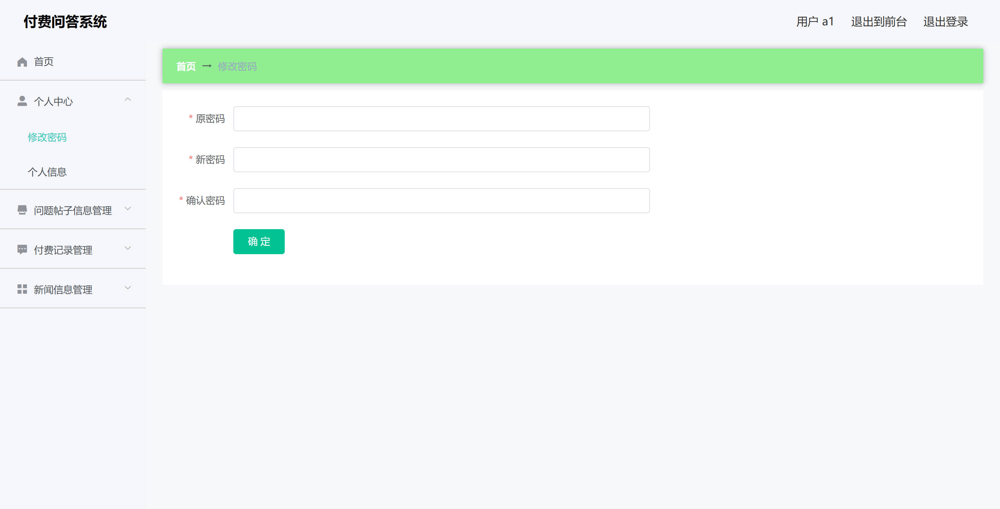

<h1 align="center">基于SpringBoot的付费问答系统【带论文】</h1>

- <b>完整代码获取地址：从戎源码网 ([https://armycodes.com/](https://armycodes.com/))</b>
- <b>技术探讨、资料分享，请加QQ群：692619798</b>
- <b>作者微信：19941326836  QQ：3645296857</b>
- <b>承接计算机毕业设计、Java毕业设计、Python毕业设计、深度学习、机器学习</b>
- <b>选题+开题报告+任务书+程序定制+安装调试+论文+答辩ppt 一条龙服务</b>
- <b>所有选题地址 ([https://github.com/Descartes007/allProject](https://github.com/Descartes007/allProject)) </b>

## 一、项目介绍

基于SpringBoot的付费问答系统，系统角色为管理员（后台）和普通用户（前端），主要功能如下：
### 管理员：
- 基本操作：管理员账号登录、注册、修改密码、获取/修改个人信息、获取 session 信息、注销
- 用户管理：用户（yonghu）列表分页、查看详情、新增、修改、逻辑删除、重置密码、批量导入（Excel）
- 管理员账号管理：管理员列表分页、查看详情、新增、修改、删除、重置密码
- 帖子管理（forum）：后台帖子分页/列表、查看详情、保存（新增）、更新、删除、批量导入
- 付费记录管理（fufeijilu）：付费记录分页/查询/删除/详情（后台 CRUD）
- 新闻管理（news）：新闻列表/详情/新增/修改/删除（富文本支持）
### 普通用户（前端 yonghu）：
- 基本操作：用户注册、登录、修改密码、获取/修改个人信息、注销
- 帖子交互：前端帖子列表（/forum/list）、查看详情（/forum/detail/{id}）、发布帖子（/forum/add）
- 支付与记录：前端支付页面、查看个人付费记录
- 新闻浏览：前端新闻列表与详情
- 文件上传：头像/富文本图片上传

## 二、项目技术

- 编程语言与运行：Java 1.8（后端）、JavaScript（前端）
- 后端框架与库：Spring Boot (2.2.x)、Spring（生态）、MyBatis / MyBatis-Plus、FastJson、Hutool、MySQL
- 前端框架与库：Vue 2.x、Vue Router、Element UI、Axios（请求封装）、vue-quill-editor（富文本）、

## 三、运行环境

- JDK版本：1.8及以上都可以
- 操作系统：Windows7/10、MacOS
- 开发工具：IDEA、Ecplise、MyEclipse都可以

## 四、数据库配置文件

- npm版本：6.14.13及以上都可以
- Redis版本：3.2.100及以上都可以
- 文件名：application.yml
- 编码类型：utf8

## 论文截图

## 系统截图

